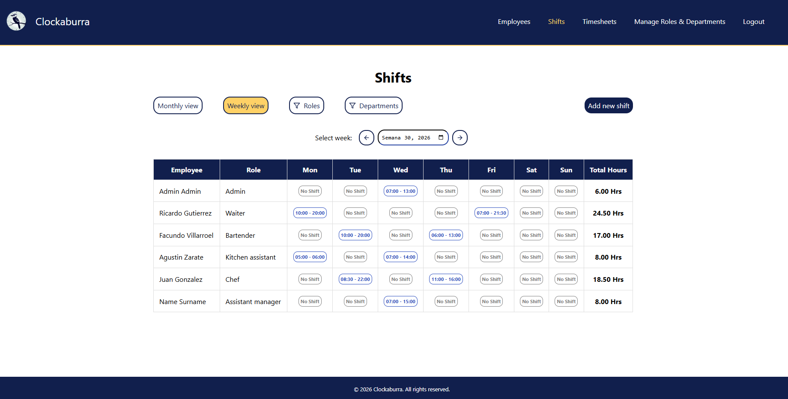

# Clockaburra Web

Frontend application for the Clockaburra employee management platform.

Clockaburra Web is the main client application of the Clockaburra ecosystem, providing an intuitive interface for managing employees, departments, shifts and attendance records. The application communicates with the Clockaburra REST API and was designed following a component-based architecture focused on maintainability and reusability.

Built with **React**, **Redux Toolkit**, **React Router**, **Styled Components** and **Firebase Authentication**.

## Product Demo

Explore the complete Clockaburra ecosystem in this short product walkthrough.

🎥 [Product Walkthrough](https://www.youtube.com/watch?v=IoPG2P4DQTI)

<p align="center">
  
</p>

## Features

- 👥 Employee management through an intuitive interface.
- 🏢 Department administration.
- 🗓️ Shift scheduling.
- ⏱️ Employee attendance tracking.
- 🔐 Secure authentication with Firebase and Google OAuth.
- 📱 Responsive layout for different screen sizes.
- 🔄 Integration with the Clockaburra REST API.

- ## Tech Stack

| Category | Technologies |
|----------|--------------|
| **Framework** | React |
| **State Management** | Redux Toolkit · React Redux |
| **Routing** | React Router DOM |
| **Styling** | Styled Components |
| **Authentication** | Firebase Authentication · Google OAuth |
| **Date & Time** | Luxon · React Datepicker |
| **Icons** | React Icons |

## Architecture

### Component-Based Architecture

The application follows a component-based architecture that promotes reusability, separation of concerns and maintainability.

The project is organized into reusable UI components, application pages, Redux slices, services and utilities, making it easier to extend and maintain as the application grows.

### Design Decisions

Some of the design decisions implemented in this project include:

- Reusable UI components.
- Global state management with Redux Toolkit.
- Protected routes using Firebase Authentication.
- Separation between presentation and API communication.
- Responsive layouts for desktop and mobile devices.
- Shared REST API with the backend application.

### Project Structure

```text
Clockaburra-Web
│
├── public/
│
├── src
│   ├── assets/          # Images, icons and static resources
│   ├── components/      # Reusable UI components
│   ├── layouts/         # Shared application layouts
│   ├── pages/           # Application pages
│   ├── routes/          # Route definitions
│   ├── services/        # API communication layer
│   ├── store/           # Redux store configuration
│   ├── slices/          # Redux Toolkit slices
│   ├── styles/          # Global styles and themes
│   ├── utils/           # Shared helper functions
│   ├── App.jsx
│   └── main.jsx
│
├── package.json
├── vite.config.js
└── README.md
```

### Folder Overview

| Folder | Responsibility |
|---------|----------------|
| **components** | Reusable UI components shared across the application. |
| **pages** | Main application screens rendered by the router. |
| **layouts** | Shared layouts used by multiple pages. |
| **routes** | Application routing configuration. |
| **services** | Handles communication with the REST API. |
| **store** | Redux store configuration. |
| **slices** | Redux Toolkit slices responsible for application state. |
| **styles** | Global styles and theme configuration. |
| **assets** | Static resources such as images and icons. |
| **utils** | Shared utility functions. |


## State Management

Global application state is managed using **Redux Toolkit**.

State is organized into independent slices, allowing different application domains to remain isolated while sharing a centralized store.

This approach simplifies state updates, improves maintainability and makes the application easier to scale as new features are introduced.

## API Integration

The application communicates with the Clockaburra REST API through a dedicated service layer.

This separation keeps UI components independent from API implementation details, making it easier to maintain, test and evolve the application while sharing the same backend with the mobile client.

## Authentication

Authentication is handled using **Firebase Authentication**.

Protected routes ensure that only authenticated users can access the application's private areas, while JWT tokens are used to securely communicate with the backend API.

## Getting Started

### Requirements

Before running the project, make sure you have:

- Node.js 20+
- npm
- Clockaburra REST API running
- Firebase project configured

---

### Installation

```bash
git clone https://github.com/FacundoVillarroel/Clockaburra-Web.git

cd Clockaburra-Web

npm install
```

---

### Environment Variables

Create a `.env` file.

Example:

```env
REACT_APP_API_URL=http://localhost:8080

REACT_APP_API_KEY=your_firebase_api_key

REACT_APP_FIREBASE_AUTH_DOMAIN=your_firebase_auth_domain

REACT_APP_FIREBASE_PROJECT_ID=your_firebase_project_id
```
> **Note:** The complete list of environment variables depends on your Firebase and Mailjet configuration.
---

### Running

```bash
npm run dev
```

The application will be available at:

```
The application will run at `http://localhost:3000/` by default.​
```

## Why I Built This Project

Clockaburra Web was created to explore how a modern frontend application can be structured beyond building individual pages.

The goal was to design a scalable interface capable of consuming a shared REST API while keeping the code organized through reusable components, centralized state management and clear separation of responsibilities.

Developing this project allowed me to improve my understanding of application architecture, authentication flows, global state management and communication between frontend and backend services.

## Related Projects

- **[Clockaburra REST API](https://github.com/FacundoVillarroel/Clockaburra-RESTful-API)** → Backend REST API powering the platform.

- **[Clockaburra Web](https://github.com/FacundoVillarroel/Clockaburra-Web)** → Web application for administrators and managers.

- **[Clockaburra Mobile](https://github.com/FacundoVillarroel/Clockaburra-App)** → Native mobile application for employees.

## Author

**Facundo Villarroel**

Full Stack Software Development with a strong interest in software architecture and scalable backend systems.
- GitHub: https://github.com/FacundoVillarroel
- LinkedIn: https://www.linkedin.com/in/villarroelfacundo/

---

## License

This project is licensed under the MIT License.
